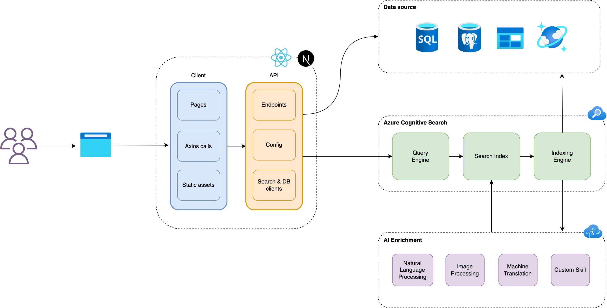

# React Global Summit 2022 (Demo)
This is the demo code I presented at the [React Global Summt 2022](https://events.geekle.us/react2/).

## Quickstart

Make sure to provision the following in Azure:
1. [Azure Cognitive Search](https://azure.microsoft.com/en-au/services/search/)
2. [Azure Storage account](https://docs.microsoft.com/en-us/azure/storage/common/storage-account-create?tabs=azure-portal)

Then update the configuration in a .env.local file.

```sh
touch .env.local
echo "SEARCH_URL=https://<search-service-name>.search.windows.net" >> .env.local
echo "SEARCH_KEY=AZ Portal > Search service > Keys" >> .env.local
echo "DB_ENDPOINT=https://<storage-account-name>.table.core.windows.net" >> .env.local
echo "DB_ACCOUNT_NAME=AZ Portal > Storage account > Keys" >> .env.local
echo "DB_ACCOUNT_KEY=AZ Portal > Storage account > Keys" >> .env.local
echo "DB_TABLE_NAME=<table-name>" >> .env.local
```

To start the development server:

```sh
cd src && yarn && yarn dev
```

## Architecture


## Link to the talk's slide:

[SpeakerDeck](https://speakerdeck.com/sahansera/infusingintelligence)
